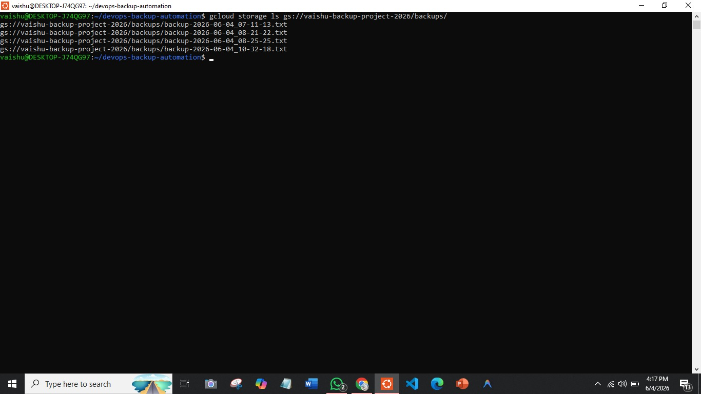
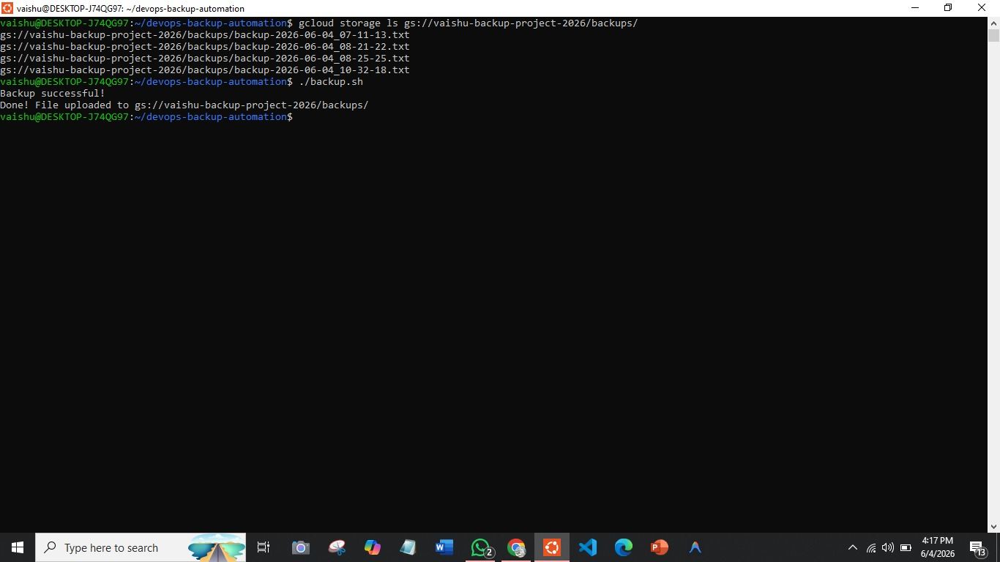
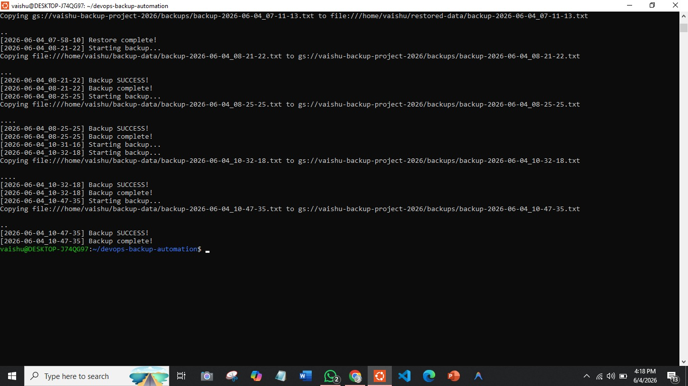
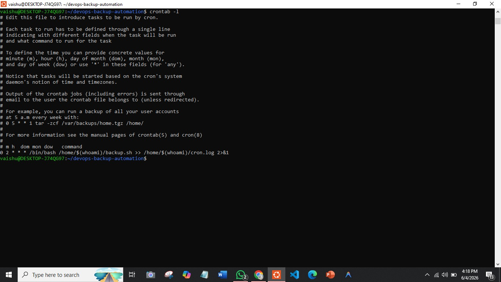
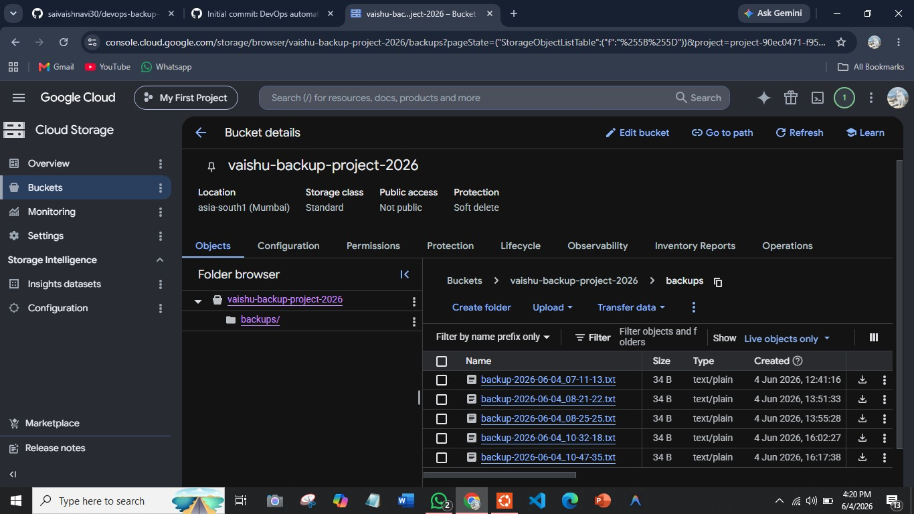

# Cloud Backup & Disaster Recovery — GCP

I built this to understand how cloud storage actually works in practice —
not just the theory, but setting it up, automating it, and making sure
data can be recovered when something goes wrong.

## What it does
- Automatically backs up files to Google Cloud Storage every day
- Verifies each backup succeeded and logs the result
- Restores all files from the cloud with a single command if data is lost

## Scripts
- backup.sh — creates a timestamped backup file and uploads it to GCS
- restore.sh — pulls everything back from GCS to local when needed

## Tools Used
GCP · Cloud Storage · gcloud CLI · Bash · Cron · Ubuntu · Git

## How to Run
bash backup.sh
bash restore.sh
cat ~/backup.log

## Screenshots

